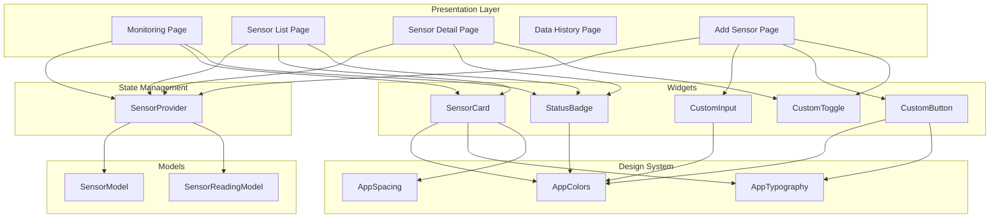
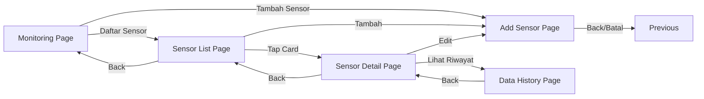

# Design Document: Sensor Monitoring App

## Overview

Aplikasi Flutter untuk monitoring sensor dengan arsitektur yang terorganisir menggunakan folder structure standar. Aplikasi terdiri dari 5 halaman utama dengan design system yang konsisten dan state management menggunakan Provider untuk mengelola data sensor.

## Architecture



## Folder Structure

```
lib/
├── main.dart
├── design_system/
│   ├── colors.dart
│   ├── typography.dart
│   └── spacing.dart
├── models/
│   ├── sensor_model.dart
│   └── sensor_reading_model.dart
├── presentation/
│   ├── pages/
│   │   ├── monitoring_page.dart
│   │   ├── sensor_list_page.dart
│   │   ├── sensor_detail_page.dart
│   │   ├── data_history_page.dart
│   │   └── add_sensor_page.dart
│   └── widgets/
│       ├── sensor_card.dart
│       ├── custom_button.dart
│       ├── custom_input.dart
│       ├── status_badge.dart
│       ├── summary_card.dart
│       └── custom_toggle.dart
├── controllers/
│   └── sensor_provider.dart
├── services/
│   └── sensor_service.dart
└── config/
    └── routes.dart
```

## Components and Interfaces

### Design System Components

#### AppColors

```dart
class AppColors {
  static const Color primary = Color(0xFF2563EB);      // Blue
  static const Color secondary = Color(0xFF06B6D4);    // Cyan
  static const Color success = Color(0xFF22C55E);      // Green
  static const Color warning = Color(0xFFF59E0B);      // Amber
  static const Color danger = Color(0xFFEF4444);       // Red
  static const Color background = Color(0xFFF5F7FB);   // Light Gray
  static const Color elevated = Color(0xFFFFFFFF);     // White
  static const Color textPrimary = Color(0xFF0F172A);  // Dark
  static const Color textSecondary = Color(0xFF475569); // Gray
}
```

#### AppTypography

```dart
class AppTypography {
  static const TextStyle title = TextStyle(
    fontSize: 22,
    fontWeight: FontWeight.w600,
  );
  static const TextStyle section = TextStyle(
    fontSize: 18,
    fontWeight: FontWeight.w600,
  );
  static const TextStyle body = TextStyle(
    fontSize: 14,
    fontWeight: FontWeight.w400,
  );
  static const TextStyle caption = TextStyle(
    fontSize: 13,
    fontWeight: FontWeight.w400,
  );
  static const TextStyle button = TextStyle(
    fontSize: 14,
    fontWeight: FontWeight.w600,
  );
}
```

#### AppSpacing

```dart
class AppSpacing {
  static const double grid = 8.0;
  static const double radius = 14.0;
  static const double cardPadding = 16.0;
  static const double cardPaddingLarge = 20.0;
  static const List<double> cardShadow = [0, 6, 16];
  static const List<double> floatingShadow = [0, 10, 24];
  static const double buttonHeight = 48.0;
}
```

### Widget Interfaces

#### SensorCard Widget

```dart
class SensorCard extends StatelessWidget {
  final String name;
  final String location;
  final String value;
  final String unit;
  final SensorStatus status;
  final String timestamp;
  final VoidCallback? onTap;
}
```

#### CustomButton Widget

```dart
class CustomButton extends StatelessWidget {
  final String text;
  final VoidCallback onPressed;
  final ButtonVariant variant; // primary, secondary
  final bool isFullWidth;
}
```

#### CustomInput Widget

```dart
class CustomInput extends StatelessWidget {
  final String label;
  final String? placeholder;
  final TextEditingController controller;
  final String? errorText;
  final TextInputType? keyboardType;
}
```

#### StatusBadge Widget

```dart
class StatusBadge extends StatelessWidget {
  final SensorStatus status;
  final bool isCompact;
}

enum SensorStatus { normal, peringatan, tinggi, rendah, nonaktif }
```

#### SummaryCard Widget

```dart
class SummaryCard extends StatelessWidget {
  final IconData icon;
  final String label;
  final int count;
  final Color color;
}
```

#### CustomToggle Widget

```dart
class CustomToggle extends StatelessWidget {
  final bool value;
  final ValueChanged<bool> onChanged;
  final String? label;
}
```

## Data Models

### SensorModel

```dart
class SensorModel {
  final String id;
  final String name;
  final String location;
  final SensorType type;
  final String unit;
  final double minNormal;
  final double maxNormal;
  final bool isActive;
  final String? notes;
  final double? currentValue;
  final SensorStatus? currentStatus;
  final DateTime? lastUpdated;
}

enum SensorType { suhu, kelembapan, ph, cahaya, tekanan }
```

### SensorReadingModel

```dart
class SensorReadingModel {
  final String id;
  final String sensorId;
  final double value;
  final SensorStatus status;
  final DateTime timestamp;
}
```

## State Management Design

### SensorProvider

```dart
class SensorProvider extends ChangeNotifier {
  List<SensorModel> _sensors = [];
  List<SensorReadingModel> _readings = [];

  // Getters
  List<SensorModel> get sensors => _sensors;
  List<SensorModel> get activeSensors;
  List<SensorModel> get warningSensors;
  int get totalSensorCount;
  int get activeSensorCount;
  int get warningCount;

  // Methods
  void addSensor(SensorModel sensor);
  void updateSensorStatus(String sensorId, bool isActive);
  SensorModel? getSensorById(String sensorId);
  List<SensorReadingModel> getReadingsForSensor(String sensorId);
  List<SensorModel> filterSensors(SensorFilter filter);
  List<SensorModel> searchSensors(String query);
}

enum SensorFilter { semua, aktif, nonaktif, peringatan }
```

## Page Designs

### 1. Monitoring Page (Home)

- AppBar dengan title "Monitoring Sensor" dan link "Daftar Sensor"
- 3 SummaryCard horizontal: Total Sensor, Sensor Aktif, Peringatan
- Section "Data Terbaru" dengan timestamp
- List of SensorCard showing latest readings
- Bottom button "Tambah Sensor"

### 2. Sensor List Page

- AppBar dengan back button, title "Daftar Sensor", dan "Tambah" link
- SearchBar untuk pencarian
- Filter chips: Semua, Aktif, Nonaktif, Peringatan
- List of SensorCard (compact version with timestamp)
- Each card navigates to Sensor Detail

### 3. Sensor Detail Page

- AppBar dengan back button, title "Detail Sensor", dan "Edit" link
- Info section: Nama Sensor, Lokasi, Tipe Sensor, Status
- Large value display (e.g., "27.4 °C")
- Pengaturan section dengan "Sensor Aktif" toggle
- Button "Lihat Riwayat Data"

### 4. Data History Page

- AppBar dengan back button dan title "Riwayat Data"
- Sensor name display
- Checkbox "Rentang Tanggal" untuk filter
- List of reading entries dengan timestamp, value, dan status badge

### 5. Add Sensor Page

- AppBar dengan back button dan title "Tambah Sensor"
- Form fields:
  - Nama Sensor (text input)
  - Lokasi (text input)
  - Tipe Sensor (dropdown)
  - Satuan (text input with hint)
  - Batas Normal min-max (two text inputs)
  - Aktifkan Sensor (toggle)
  - Catatan (text area, optional)
- Bottom buttons: Batal, Simpan

## Navigation Flow



## Correctness Properties

_A property is a characteristic or behavior that should hold true across all valid executions of a system—essentially, a formal statement about what the system should do. Properties serve as the bridge between human-readable specifications and machine-verifiable correctness guarantees._

### Property 1: Summary Counts Match State

_For any_ sensor list state, the displayed Total Sensor count, Sensor Aktif count, and Peringatan count on Monitoring Dashboard SHALL equal the actual counts computed from the sensor list.

**Validates: Requirements 2.1**

### Property 2: Sensor Card Data Completeness

_For any_ sensor displayed in a SensorCard widget, the rendered output SHALL contain the sensor name, location, current value with unit, status badge, and timestamp.

**Validates: Requirements 2.3**

### Property 3: Filter Produces Correct Subset

_For any_ list of sensors and any selected filter (Semua, Aktif, Nonaktif, Peringatan), the filtered result SHALL only contain sensors that match the filter criteria, and SHALL contain all sensors that match.

**Validates: Requirements 3.3**

### Property 4: Toggle Updates Sensor Status

_For any_ sensor, when the Sensor Aktif toggle is changed, the sensor's isActive property in state SHALL be updated to match the toggle value.

**Validates: Requirements 4.4, 7.3**

### Property 5: Form Validation Correctness

_For any_ form input to Add Sensor Form, validation SHALL return errors for all missing required fields (Nama Sensor, Lokasi, Tipe Sensor) and SHALL pass when all required fields are provided.

**Validates: Requirements 6.8, 6.9**

### Property 6: Add Sensor Updates State

_For any_ valid sensor data submitted through Add Sensor Form, the sensor list state SHALL contain the new sensor with all provided properties preserved.

**Validates: Requirements 6.10, 7.2**

### Property 7: Search Filters by Name or Location

_For any_ search query and sensor list, the search result SHALL only contain sensors where the name OR location contains the search query (case-insensitive).

**Validates: Requirements 3.1**

## Error Handling

### Form Validation Errors

- Empty required fields: Display "Field ini wajib diisi" below the input
- Invalid min/max range (min > max): Display "Nilai min harus lebih kecil dari max"

### State Errors

- Sensor not found: Return null and handle gracefully in UI
- Invalid sensor ID: Log error and show user-friendly message

### Navigation Errors

- Missing route parameters: Navigate back to previous page with error toast

## Testing Strategy

### Unit Tests

Unit tests will verify specific examples and edge cases:

- Design system color values match hex codes
- Typography font sizes and weights are correct
- Spacing values match specifications
- SensorModel serialization/deserialization
- SensorStatus enum mapping to colors
- Form field validation logic

### Property-Based Tests

Property-based tests will use the `dart_quickcheck` or `glados` package for Dart:

1. **Summary Count Property Test**

   - Generate random lists of sensors with various active/warning states
   - Verify computed counts match actual list filtering
   - Minimum 100 iterations

2. **Filter Property Test**

   - Generate random sensor lists and random filter selections
   - Verify filtered results are correct subsets
   - Minimum 100 iterations

3. **Toggle Status Property Test**

   - Generate random sensors and toggle values
   - Verify state updates correctly
   - Minimum 100 iterations

4. **Validation Property Test**

   - Generate random form inputs (valid and invalid)
   - Verify validation correctly identifies errors
   - Minimum 100 iterations

5. **Add Sensor Property Test**

   - Generate random valid sensor data
   - Verify sensor is added to state with correct properties
   - Minimum 100 iterations

6. **Search Property Test**
   - Generate random sensor lists and search queries
   - Verify search results match criteria
   - Minimum 100 iterations

### Widget Tests

- Verify SensorCard renders all required information
- Verify CustomButton responds to taps
- Verify CustomInput shows error states
- Verify StatusBadge shows correct colors

### Integration Tests

- Navigation flow from Monitoring to Sensor List
- Add sensor flow and state update
- Toggle sensor status and verify persistence
